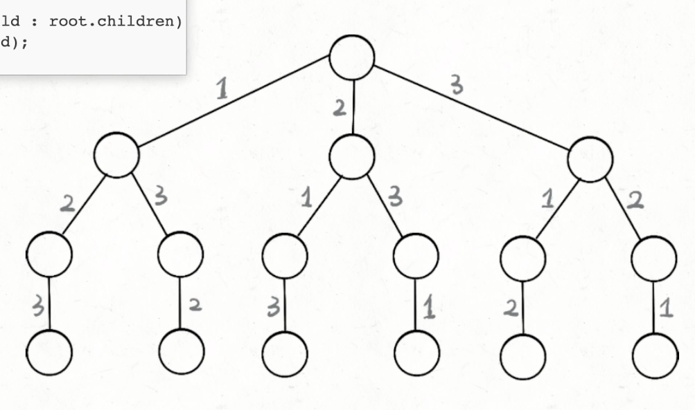

## 回溯

回溯本质就是一种暴力穷举算法

通常用于求所有的可行解

可以对应成一棵多叉树，回溯算法过程可以看成遍历一棵多叉树的过程



### 回溯算法框架

```java
List<Value> result;
void backtrack(路径, 选择列表) {
  if (满足结束条件) {
    result.add(路径);
    return;
  }
  for (选择: 选择列表) {
    if (选择不合理) continue;
    做选择;
    backtrack(路径, 选择列表);
    撤销选择;
  }
}
```

### 技巧

1. 回溯的时间复杂度通常会非常高，所以预先对数据进行处理对时间复杂度不会有太大影响，比如可以对数据先进行排序
