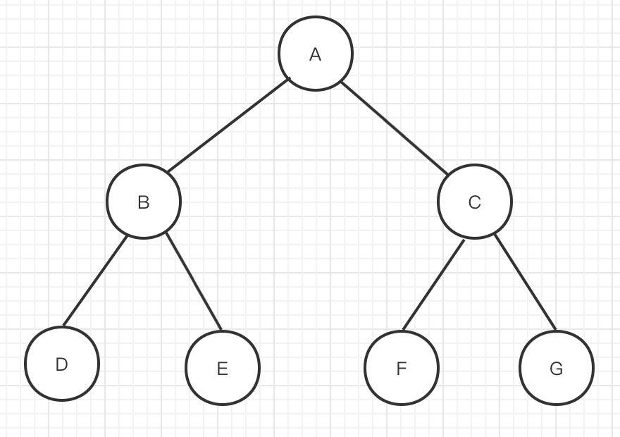

## 遍历

### 三种遍历方式

二叉树遍历有三种，是以头节点遍历顺序进行命名的

整体要从左往右遍历

> **先序遍历**：**头节点** => 左子树 => 右子树
>
> **中序遍历**：左子树 => **头节点** => 右子树
>
> **后序遍历**：右子树 => 左子树 => **头节点**
> 

>先序遍历: A->B->D->E->C->F->G
>
>中序遍历: D->B->E->A->F->C->G
>
>后续遍历: D->E->B->F->G->C->A

**递归序**

>A B D D D B E E E B A C F F F C G G G C A
>
>每个节点会遍历三次，如果在首次遍历节点时进行操作，则是先序遍历，以此类推
>
>```java
>public static void f(Node head) {
>  if(head == null) {
>    return;
>  }
>  // 1
>  f(head.left)
>  // 2
>  f(head.right)
>  // 3
>}
>```

### 相关结论

**对于节点 x，先序遍历 x 左侧的列表与后序遍历 x 右侧列表的交集，为 x 的祖先节点**

> 对于上面的树
>
> F 节点先序遍历 A->B->D->E->C->**F**->G
> F 节点后序遍历 D->E->B->**F**->G->C->A
>
> 先序遍历左侧 A B D E C
> 后序遍历右侧 G C A
> 两者交集 A C
>
> 结论证明：
>
> 先证明祖先节点一定在交集中
> 先序遍历中， F 的左侧，必定有 F 的祖先节点，因为其祖先节点一定比 F 先遍历
> 后序遍历中，F 的右侧，必定有 F 的祖先节点，因为其祖先节点一定比 F 晚遍历
>
> 再证明祖先节点之外的节点不在交集汇总
> 除祖先节点，还有下面节点：子节点，F 作为左树姿态下的右兄弟们，F 作为右树姿态的左兄弟们
>
> > 左树姿态的右兄弟就如 E 节点，它的左树姿态右兄弟节点认为CFG
> > B 节点，它的左树姿态右兄弟节点也认为是CFG
> > 实则就是对于一对兄弟节点，只要目标节点在左子树下就算左树姿态下的右兄弟
>
> F 的子节点一定在先序遍历 F 的右侧，因为他们一定在 F 之后遍历
> F 作为左树姿态的右兄一定在先序遍历 F 的右侧
> F 作为右树姿态的左兄一定在后序遍历 F 的左侧

### 遍历模板

```kotlin
fun traverse(root: TreeNode) {
  var cur: TreeNode? = root
  val stack = Stack<TreeNode>()
  while (cur != null || stack.isNotEmpty()) {
    while(cur != null) {
      // 前序遍历访问
      stack.push(cur)
      cur = cur.left
    }
    val node = stack.pop()
    // 中序遍历访问
    cur = node.right
  }
}

// 后序遍历为前序遍历的左右交换，再逆序
```

