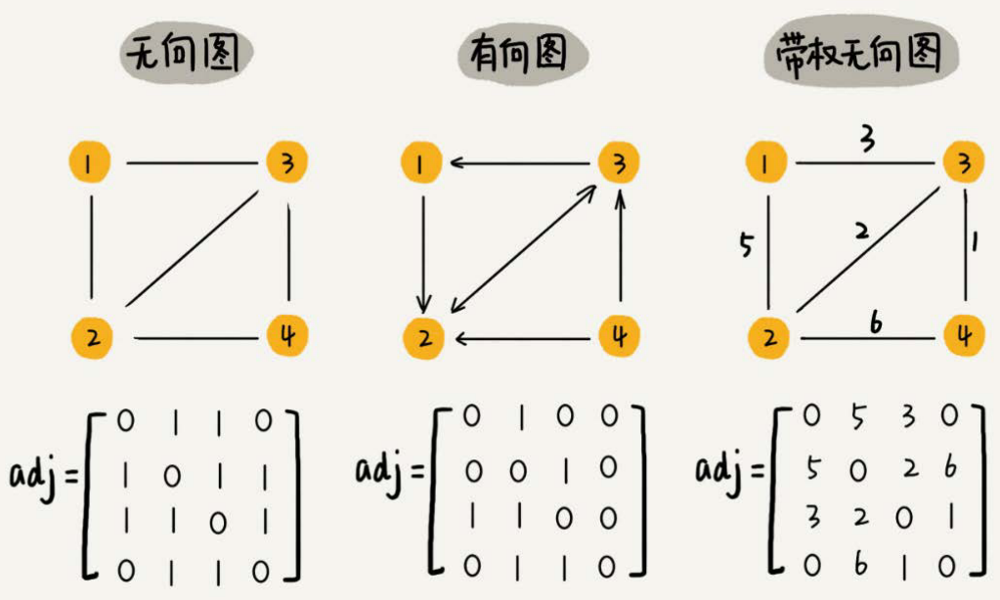
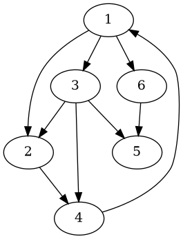

## 图

图的数据结构包含一个有限（可能是可变的）的[集合](https://zh.wikipedia.org/wiki/集合_(计算机科学))作为**节点**集合，以及一个无序对（对应无向图）或有序对（对应有向图）的集合作为**边**（有向图中也称作**弧**）的集合。节点可以是图结构的一部分，也可以是用整数下标或[引用](https://zh.wikipedia.org/wiki/引用_(程序设计))表示的外部实体。

1) 由点的集合和边的集合构成
2) 虽然存在有向图和无向图的概念，但实际上都可以用有向图来表达
3) 边上可能带有权值

树和链表属于特殊的图，树要求**每个节点最多有一个父节点**，链表要求**每个节点最多有一个父节点**且**每个节点最多有一个子节点**

### 图的具体表达

#### 邻接表

每个节点都有对应的邻接信息表（相邻节点信息或者权重信息）

#### 邻接矩阵

用一个矩阵表示各节点的路径关系以及路径的权重信息



#### 笔试面试常见表达

##### 表达一

```txt
[
	[3, 0, 7],
	[5, 1, 2],
	[6, 2, 7],
	...
]
```

[3, 0, 7] 是一条边，权重是 3，由节点 0 指向节点 7

##### 表达二

[3, 1, 1, 1]，i 表示索引，则节点 i 指向 a[i] 节点

#### 自己的图实现

统一用一种图实现，对于各种不同给的数据结构，先转化为统一的图实现即可

### 面试

图的算法通常不难，难点是图结构的建立，可以建立一种通用的代码实现，并且熟悉其代码，对于不同的问题，将其转化为熟悉的结构

### 样例

```kotlin
val graph = generateGraph(arrayOf(
    intArrayOf(1, 1, 2),
    intArrayOf(1, 1, 3),
    intArrayOf(1, 1, 6),
    intArrayOf(1, 2, 4),
    intArrayOf(1, 3, 2),
    intArrayOf(1, 3, 4),
    intArrayOf(1, 3, 5),
    intArrayOf(1, 4, 1),
    intArrayOf(1, 6, 5),
    ))
```


### 拓扑排序

特指图论中的排序方法，它可以应用于有向无环图（DAG-Directed Acyclic Graph）中。在拓扑排序中，图中的节点被线性排序，使得对于任何连接两个节点的有向边 (u, v)，节点 u 在排序结果中出现在节点 v 的前面。换句话说，如果图中存在一条从节点 u 到节点 v 的路径，那么在排序结果中节点 u 将出现在节点 v 的前面。

拓扑排序在许多应用中都非常有用，比如**任务调度**、**依赖关系解析**等。

#### 基于入度排序

拓扑排序的步骤通常如下：

1. **确定入度**：对于图中的每个节点，计算其入度（即指向该节点的边的数量）。
2. **初始化**：将入度为 0 的节点加入待处理的集合中。
3. **循环处理**：循环执行以下步骤直到待处理集合为空：
   - 从待处理集合中选择一个入度为 0 的节点，将其输出到排序结果中。
   - 将该节点的所有邻接节点的入度减 1。如果某个邻接节点的入度变为 0，则将其加入待处理集合中。
4. **检查环**：如果排序结果中的节点数量少于图中的节点数量，则说明图中存在环，无法进行拓扑排序。
5. **输出结果**：排序完成后，输出排序结果，即为拓扑排序的结果。

这些步骤保证了拓扑排序的正确性，确保了在排序结果中，所有节点都能按照其依赖关系被正确排序。

#### 基于点次排序

如果从节点 A 出发能达到的节点数 大于从节点 B 出发能到达的节点数，则拓扑排序结果 A 一定在 B 前面

#### 基于最大深度排序

如果从节点 A 出发能到达的最大深度大于从节点 B 出发能到达的最大深度，则拓扑排序结果 A 一定在 B 前面

### 最小生成树算法

最小生成树算法通常用于**无向图**，因为最小生成树是一个**无向树结构**。对于有向图，有一些变种算法可以计算出最小生成森林，但通常不直接使用最小生成树算法。在有向图中，**边的方向可能会影响算法的选择和最终结果**。

如果要计算有向图的最小生成树，需要提供一个起始节点，这个时候获取到的最小生成树是局部的

#### Kruskal

[克鲁斯克尔算法](https://zh.wikipedia.org/zh-hans/克鲁斯克尔演算法)

Kruskal 算法是一种用来查找最小生成树的算法，用来解决同样问题的还有 Prim（普林） 算法和 （布卢瓦卡）算法，三种算法都是贪心算法的应用，和布卢瓦卡算法不同的地方是，克鲁斯克尔算法在图中存在相同权值的边时也有效。

查找最小生成树是为了只保留权值最小的边，但能保证图中所有节点联通

具体步骤如下：

1) 总是从权值最小的边开始考虑，依次考察权值依次变大的边
2) 当前的边要么进入最小生成树的集合，要么丢弃
3) 如果当前的边进入最小生成树的集合中不会形成环，就要当前边
4) 如果当前的边进入最小生成树的集合中会形成环，就不要当前边
5) 考察完所有边之后，最小生成树的集合也得到了

关键点是如何判断当前选取边是否构成环

> 通过并查集来判断，把所有节点单独作为一个集合
>
> 添加边时，将两个节点所在集合合并，如果已经属于同一个集合，则不将该边加入最后结果

#### Prim

普林算法

具体步骤如下：

1) 可以从任意节点出发来寻找最小生成树
2) 某个点加入到被选取的点中后，解锁这个点出发的所有新的边
3) 在所有解锁的边中选最小的边，然后看看这个边会不会形成环
4) 如果会，不要当前边，继续考察剩下解锁的边中最小的边，重复3）
5) 如果不会，要当前边，将该边的指向点加入到被选取的点中，重复2）
6) 当所有点都被选取，最小生成树就得到了

#### 结论

对于边数量远大于点数量时，Prim 算法效率更高，因为它只需要解锁完所有点就可以完成

对于点数量远大于边数量时，Kruskal 算法效率更高，因为它只需要解锁完所有边就可以完成

整体上两个算法效率差距不大

### 最短路径问题

#### 迪杰特斯拉算法

Dijkstra

有向无负权重，可以有环（严格来说是没有一个路径累加和为负值的环）

该算法可以计算从一个节点出发，能到达的所有节点的最小的路径权重和

具体步骤如下：

1) 创建一个表，存储目标节点到所有节点的距离，到自身的距离为 0，到其他节点距离初始化为正无穷

2) 从距离表中选取一个最小的距离对应的节点（除去被锁定的节点）
3) 根据最小距离对应的节点，更新到其他各节点的距离
4) 锁定 2 中选择的最小距离对应的节点
5) 重复 2-4，直到没有可以选择的节点

整体逻辑就是遍历每个节点，查找节点下的所有路径，并更新最短距离表中的结果

节点的选择是每次选择当前表中距离最短的节点