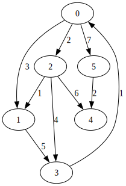

## 图

图的数据结构包含一个有限（可能是可变的）的[集合](https://zh.wikipedia.org/wiki/集合_(计算机科学))作为**节点**集合，以及一个无序对（对应无向图）或有序对（对应有向图）的集合作为**边**（有向图中也称作**弧**）的集合。节点可以是图结构的一部分，也可以是用整数下标或[引用](https://zh.wikipedia.org/wiki/引用_(程序设计))表示的外部实体。

1) 由点的集合和边的集合构成
2) 虽然存在有向图和无向图的概念，但实际上都可以用有向图来表达
3) 边上可能带有权值

树和链表属于特殊的图，树要求**每个节点最多有一个父节点**，链表要求**每个节点最多有一个父节点**且**每个节点最多有一个子节点**

### 图的具体表达

#### 邻接表

每个节点都有对应的邻接信息表（相邻节点信息或者权重信息）

#### 邻接矩阵

用一个矩阵表示各节点的路径关系以及路径的权重信息


#### 笔试面试常见表达

##### 表达一

```txt
[
	[3, 0, 7],
	[5, 1, 2],
	[6, 2, 7],
	...
]
```

[3, 0, 7] 是一条边，权重是 3，由节点 0 指向节点 7

##### 表达二

[3, 1, 1, 1]，i 表示索引，则节点 i 指向 a[i] 节点

#### 自己的图实现

统一用一种图实现，对于各种不同给的数据结构，先转化为统一的图实现即可

### 面试

图的算法通常不难，难点是图结构的建立，可以建立一种通用的代码实现，并且熟悉其代码，对于不同的问题，将其转化为熟悉的结构

### 样例

```kotlin
val graph = generateGraph(arrayOf(
    intArrayOf(1, 1, 2),
    intArrayOf(1, 1, 3),
    intArrayOf(1, 1, 6),
    intArrayOf(1, 2, 4),
    intArrayOf(1, 3, 2),
    intArrayOf(1, 3, 4),
    intArrayOf(1, 3, 5),
    intArrayOf(1, 4, 1),
    intArrayOf(1, 6, 5),
    ))
```


### 拓扑排序

特指图论中的排序方法，它可以应用于有向无环图（DAG-Directed Acyclic Graph）中。在拓扑排序中，图中的节点被线性排序，使得对于任何连接两个节点的有向边 (u, v)，节点 u 在排序结果中出现在节点 v 的前面。换句话说，如果图中存在一条从节点 u 到节点 v 的路径，那么在排序结果中节点 u 将出现在节点 v 的前面。

拓扑排序在许多应用中都非常有用，比如**任务调度**、**依赖关系解析**等。

#### 基于入度排序

拓扑排序的步骤通常如下：

1. **确定入度**：对于图中的每个节点，计算其入度（即指向该节点的边的数量）。
2. **初始化**：将入度为 0 的节点加入待处理的集合中。
3. **循环处理**：循环执行以下步骤直到待处理集合为空：
   - 从待处理集合中选择一个入度为 0 的节点，将其输出到排序结果中。
   - 将该节点的所有邻接节点的入度减 1。如果某个邻接节点的入度变为 0，则将其加入待处理集合中。
4. **检查环**：如果排序结果中的节点数量少于图中的节点数量，则说明图中存在环，无法进行拓扑排序。
5. **输出结果**：排序完成后，输出排序结果，即为拓扑排序的结果。

这些步骤保证了拓扑排序的正确性，确保了在排序结果中，所有节点都能按照其依赖关系被正确排序。

#### 基于点次排序

如果从节点 A 出发能达到的节点数 大于从节点 B 出发能到达的节点数，则拓扑排序结果 A 一定在 B 前面

#### 基于最大深度排序

如果从节点 A 出发能到达的最大深度大于从节点 B 出发能到达的最大深度，则拓扑排序结果 A 一定在 B 前面